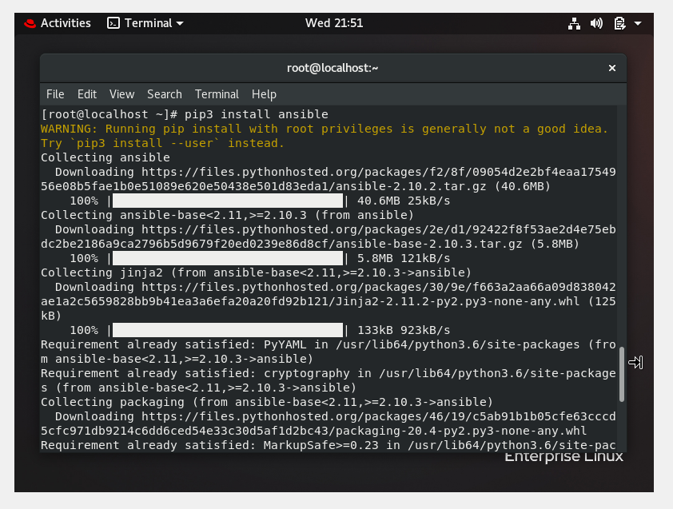
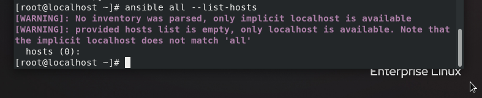
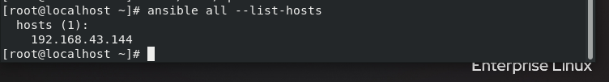
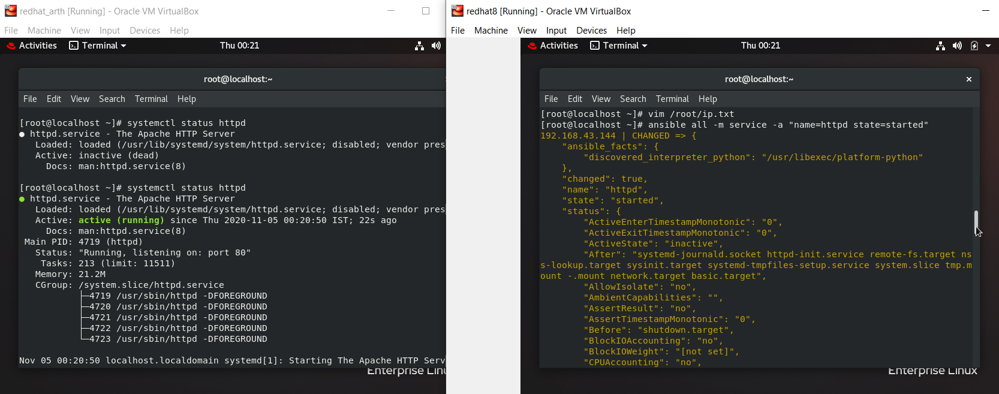

This is the first step towards ansible automation where we setup the control node, target node and make the inventory.

Currently, there is no inventory

We create an inventory

Finally, we check if our configuration is successful by starting httpd with the help of automation.

