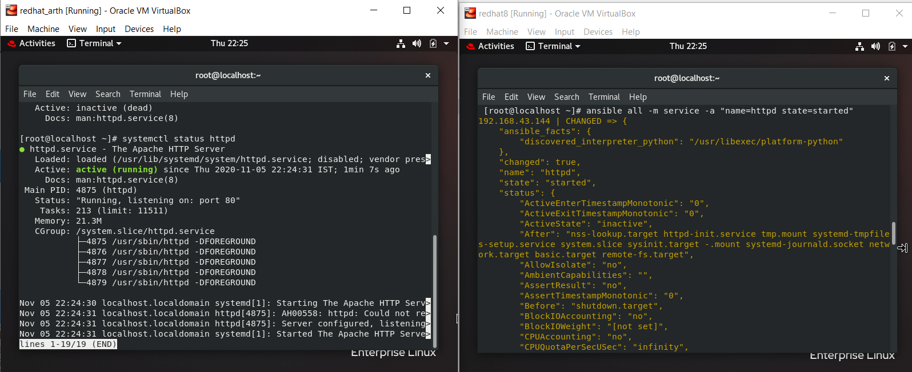

#This repository talks about a very basic use case of Ansible

Let us suppose we have a huge office with hundreds of system. Now, we need to start a service (eg httpd) on each PC/Laptop. 

Shall we go to each system and type commands manually?
Obviously NOT. That's not how REAL ENGINEERS work.

In this repository, I have demonstrated how we can install httpd, transfer required files, and start the httpd service on my target node, without visiting it.

All the commands are typed on the Control node, and we can see the desired output on the target node.

Find the Step by Step guide in the PDF!
