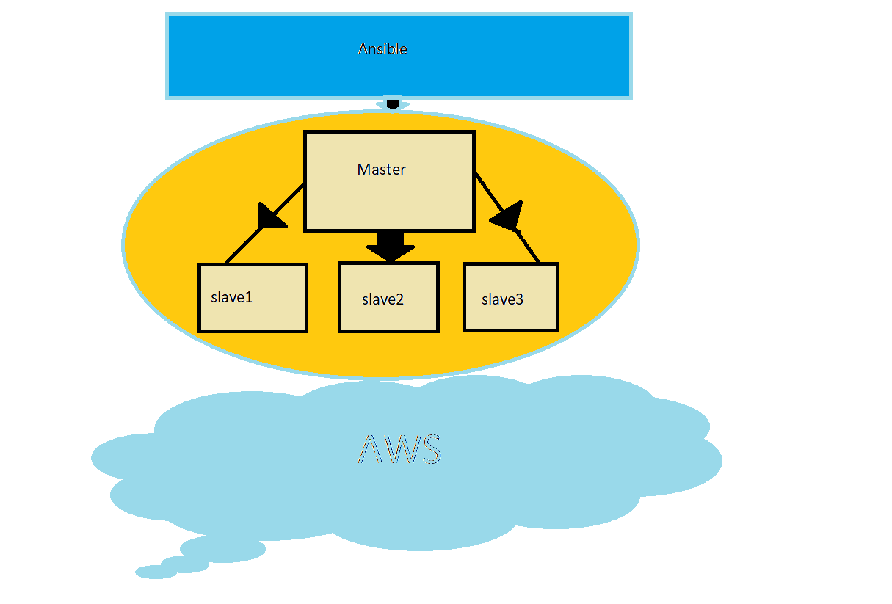

# Ansible

## We shall not only learn about ansible from core, but also try to integrate it with different technologies.

- [x] Ansible Automation 1
- [x] Ansible Automation 2
- [x] AnsibleandDocker
- [x] Ansible and httpd
- [x] Ansible Handlers and Notify
- [x] Ansible Hadoop AWS
- [x] Patting in Docker using Ansible
  #  👨🏻‍💻

