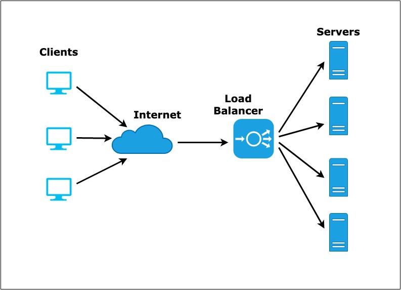

# Ansible

## Load Balancer
  ### In simple words, I have some application which has a lot of traffic. Due to this, there are cases of application crash. To get rid of this issue, I introduce the concept of load balancer in my server. It means that I provide one single IP to all the user, which is the IP of the LB. Now, LB will distribute the clients to 1000s of server running in the backend. Even if one of my backend server fails, clients will get directed to the other one. Hence, none of my user will go through the horrible experience of application crash.We shall do this using Ansible.

## We shall not only learn about ansible from core, but also try to integrate it with different technologies.

- [x] Ansible Automation 1
- [x] Ansible Automation 2
- [x] AnsibleandDocker
- [x] Ansible and httpd
- [x] Ansible Handlers and Notify
- [x] Ansible Hadoop AWS
- [x] Patting in Docker using Ansible
- [x] Load Balancer
  #  👨🏻‍💻

